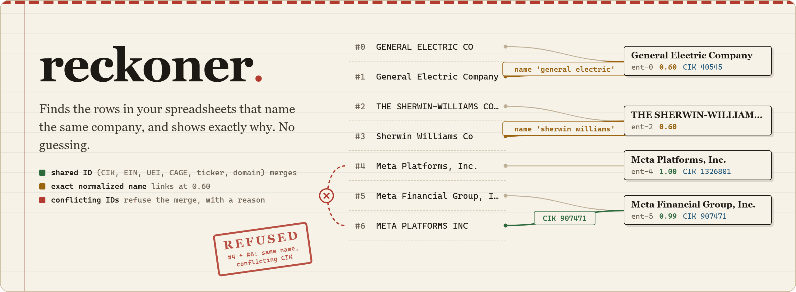
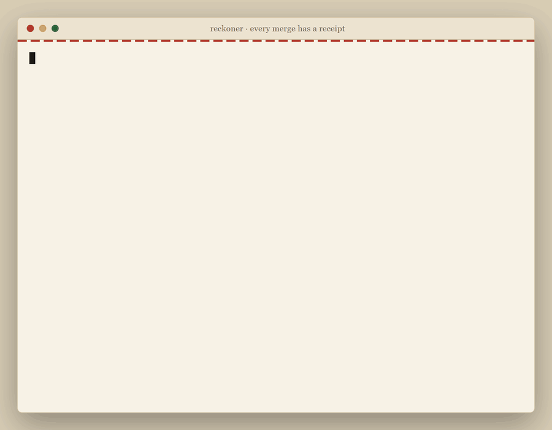
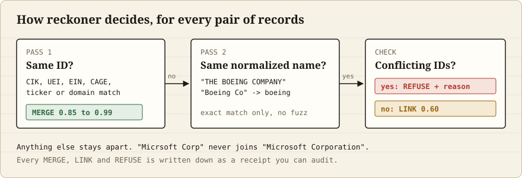

<p align="center"></p>

# reckoner

**Give it a spreadsheet of company names from different sources, and it tells you which rows are the same company, and why.** It only merges on proof (a shared ID, or the exact same name once spelling noise is removed), never on a guess, and it writes down a receipt for every merge and every refusal.

<p align="center"></p>

## Install

| Your system | One line |
| --- | --- |
| Windows (PowerShell) | `irm https://raw.githubusercontent.com/Mattbusel/reckoner/main/install.ps1 \| iex` |
| macOS or Linux | `curl -fsSL https://raw.githubusercontent.com/Mattbusel/reckoner/main/install.sh \| sh` |
| Homebrew (macOS, Linux) | `brew install mattbusel/tap/reckoner` |
| Scoop (Windows) | `scoop bucket add mattbusel https://github.com/Mattbusel/scoop-bucket; scoop install mattbusel/reckoner` |
| Python (pipx) | `pipx install git+https://github.com/Mattbusel/reckoner` |
| Just the file | [Download for Windows, macOS or Linux](https://github.com/Mattbusel/reckoner/releases/latest), unzip, run |

No Python is needed for anything except the pipx line. The install scripts check the download against the release's `SHA256SUMS.txt` before installing: `install.sh` puts `reckoner` in `~/.local/bin`, `install.ps1` puts `reckoner.exe` in `%LOCALAPPDATA%\Programs\reckoner` and adds it to your PATH.

<details>
<summary>Unsigned binary warnings, and why not <code>pip install reckoner</code></summary>

The binaries are unsigned. Windows SmartScreen may say "unknown publisher": click **More info**, then **Run anyway**. On macOS, if a downloaded binary is blocked, run `xattr -d com.apple.quarantine reckoner` (the install script does this for you).

The name `reckoner` on PyPI belongs to an unrelated Helm tool, so `pip install reckoner` installs the wrong thing. Use the pipx line above, or `pip install git+https://github.com/Mattbusel/reckoner` for the Python library.
</details>

## Use it in 3 steps

**1. See it work on built-in data.**

```bash
reckoner --demo
```

You get 7 records grouped into 4 companies, and one refused merge: two records that are both called "Meta Platforms" but carry different SEC CIK numbers, so reckoner will not join them.

**2. Point it at your own file.** A CSV, JSON or JSON Lines file with a `name` column (and, if you have them, ID columns like `cik`, `ein`, `uei`, `ticker`, `domain`):

```bash
reckoner vendors.csv
```

Every group is listed with the rows in it and the reason each row joined.

**3. Save the answer as a spreadsheet.**

```bash
reckoner vendors.csv -f csv -o resolved.csv
```

`resolved.csv` is your file, same rows, same order, with three columns added: `entity_id` (rows with the same ID are the same company), `canonical_name` and `link_confidence`.

## Results

This is the real output for [`examples/vendors.csv`](examples/vendors.csv), nine rows from three made-up feeds:

```
$ reckoner examples/vendors.csv
9 records -> 5 entities   4 merges, 0 refused

ent-0  General Electric Company     0.60  TICKER GE
       #0  GENERAL ELECTRIC CO          sec
       #1  General Electric Company     usaspending  = name 'general electric'
ent-2  The Boeing Company           0.60  TICKER BA
       #2  The Boeing Company           sec
       #3  BOEING CO                    usaspending  = name 'boeing'
ent-4  Lockheed Martin Corporation  0.90  TICKER LMT
       #4  Lockheed Martin Corporation  sec
       #5  LOCKHEED MARTIN CORP         usaspending  = name 'lockheed martin'
       #6  Lockheed Martin Corp.        sam          = TICKER LMT
ent-7  Microsoft Corporation        1.00  TICKER MSFT
ent-8  Micrsoft Corp                1.00

#n is the input record.  '= CIK 123', '= TICKER X': joined on a shared ID.
'= name ...' joined on the exact normalized name (0.60, never fuzzy).
```

Read it like this:

- **Lockheed Martin**: row 6 joined because it has the same ticker as row 4 (0.90). Row 5 has no ticker, but its name is the same once case and "CORP" are removed, so it links at 0.60.
- **Boeing**: "The Boeing Company" and "BOEING CO" both become `boeing`.
- **Micrsoft Corp stays on its own.** It is a typo, and reckoner does not guess. A wrong merge is worse than a missed one.

And when two rows look like the same name but carry different registry IDs, the merge is refused and the reason is kept (from `reckoner --demo`):

```
Refused merges (1):
  #4 + #6  'Meta Platforms, Inc.' vs 'META PLATFORMS INC'
           identical normalized names but conflicting CIK - refusing to merge
```

<p align="center"></p>

## Why it works this way

The same company is spelled differently in every system it appears in:

| One source says | Another says |
| --- | --- |
| `GENERAL ELECTRIC CO` | `GENERAL ELECTRIC COMPANY` |
| `BECTON DICKINSON & CO` | `BECTON, DICKINSON AND COMPANY` |
| `THE SHERWIN-WILLIAMS COMPANY` | `Sherwin Williams Co` |
| `Medtronic plc` | `MEDTRONIC INC` |

Join two datasets on the raw name and you silently drop many true matches. Turn on a fuzzy matcher instead and you start quietly merging companies that are not the same, with no way to explain any single decision. reckoner takes the opposite stance:

- **Identifiers merge first.** A shared CIK, UEI, EIN, CAGE, ticker or domain is the only thing that merges two records outright. Registry IDs (CIK, UEI, EIN, CAGE) link at 0.97 to 0.99; reassignable ones (ticker 0.90, domain 0.85) lower.
- **Names link only on an exact match after conservative cleanup.** Case, punctuation, `&`, a leading `The`, and trailing legal suffixes (`Inc`, `Corp`, `Company`, `LLC`, `GmbH`, `plc`, ...) are removed. Distinguishing words are never dropped. Such links score 0.60.
- **No fuzzy scoring anywhere.** A typo does not match. There is no similarity knob to tune.
- **Conflicting registry IDs block a merge.** Same normalized name but different CIKs: refused, with the reason recorded.
- **Everything is a receipt.** Every link and refusal is a `MatchRecord` with the original values, the normalized value, the method, the confidence and the evidence.

It does not do fuzzy, edit-distance or embedding matching, machine learning, or network calls. If you need probabilistic linkage across millions of noisy consumer records, use a heavier library. reckoner is for when a wrong merge is worse than a missed one and every decision has to be explainable to an analyst, an auditor or a regulator.

Pure Python standard library, zero dependencies, one file of logic ([`reckoner/resolver.py`](reckoner/resolver.py)) you can read in ten minutes.

<details>
<summary><b>Command line reference</b></summary>

```
reckoner [-h] [-f {summary,json,csv}] [-o OUTPUT] [--agency] [--demo]
         [--color {auto,always,never}] [--version] [input]
```

| Option | What it does |
| --- | --- |
| `input` | CSV, JSON array or JSON Lines file, or `-` for stdin |
| `-f summary` | readable report (default) |
| `-f json` | the full result with every match receipt |
| `-f csv` | each input row plus `entity_id`, `canonical_name`, `link_confidence` |
| `-o FILE` | write to a file instead of the terminal |
| `--agency` | government agency names: strips `U.S.` prefixes and expands `DoD`, `EPA`, ... |
| `--color` | `auto` (default: color in a terminal, off when piped or when `NO_COLOR` is set), `always`, `never` |

Recognised columns (case-insensitive): `name`, `agency`, `cik`, `uei`, `ein`, `cage`, `ticker`, `domain`, `source`, `state`. Other columns are kept in CSV output. If none of your columns are recognised, reckoner stops and tells you which columns it found and what to rename.

```bash
reckoner records.jsonl --format json      # full result with every receipt
reckoner agencies.csv --agency            # DoD, EPA, U.S. prefixes
cat companies.csv | reckoner -            # read stdin
```
</details>

<details>
<summary><b>Use it from Python</b></summary>

```python
from reckoner import EntityResolver

records = [
    {"name": "GENERAL ELECTRIC CO", "cik": "0000040545", "source": "sec"},
    {"name": "General Electric Company", "source": "usaspending"},
    {"name": "THE SHERWIN-WILLIAMS COMPANY", "source": "usaspending"},
    {"name": "Sherwin Williams Co", "source": "sec"},
    {"name": "Meta Platforms, Inc.", "cik": "1326801", "source": "sec"},
    {"name": "Meta Financial Group, Inc.", "cik": "907471", "source": "sec"},
]

result = EntityResolver().resolve(records)

for e in result["entities"]:
    print(e["canonical_name"], "<-", e["aliases"], f"(conf {e['link_confidence']})")
```

```
General Electric Company <- ['GENERAL ELECTRIC CO', 'General Electric Company'] (conf 0.6)
THE SHERWIN-WILLIAMS COMPANY <- ['THE SHERWIN-WILLIAMS COMPANY', 'Sherwin Williams Co'] (conf 0.6)
Meta Platforms, Inc. <- ['Meta Platforms, Inc.'] (conf 1.0)
Meta Financial Group, Inc. <- ['Meta Financial Group, Inc.'] (conf 1.0)
```

Both GE and Sherwin-Williams link on the normalized name (only one GE record carries the CIK, so the CIK cannot prove the link). The two Metas normalize to different names and carry different CIKs, so they never link.

When two records normalize to the same name but carry conflicting identifiers, the merge is refused and the refusal is kept:

```python
result = EntityResolver().resolve([
    {"name": "Meta Platforms, Inc.", "cik": "1326801"},
    {"name": "META PLATFORMS INC", "cik": "907471"},
])
result["entities_out"]  # 2, with a refusal receipt in result["matches"]
```

Agency names: `EntityResolver(agency_mode=True)` adds US-prefix stripping and a small alias table (`DoD` to `department of defense`, `EPA` to `environmental protection agency`, ...):

```python
EntityResolver(agency_mode=True).resolve([
    {"agency": "DoD"},
    {"agency": "U.S. Department of Defense"},
])  # -> 1 entity
```

Run the full example with `PYTHONPATH=. python examples/quickstart.py` from the repo root.
</details>

<details>
<summary><b>The output shape</b></summary>

`resolve(records)` returns a dict:

```python
{
  "entities": [ ... ],   # one canonical entity per cluster
  "clusters": [[0, 1], [2, 3], ...],   # input indices grouped
  "matches":  [ ... ],   # every MatchRecord, merged and refused
  "records_in": 6,
  "entities_out": 4,
}
```

Each entity:

```python
{
  "entity_id": "ent-0",
  "canonical_name": "General Electric Company",
  "normalized_name": "general electric",
  "identifiers": {"cik": "40545"},
  "aliases": ["GENERAL ELECTRIC CO", "General Electric Company"],
  "member_indices": [0, 1],
  "sources": ["sec", "usaspending"],
  "link_confidence": 0.6,
}
```

`link_confidence` is the strongest evidence that actually merged the cluster: an identifier's confidence if an identifier shared between members merged them, otherwise 0.60 for a name link. A single-record entity is 1.0.

Each match or refusal receipt:

```python
{
  "left_index": 0, "right_index": 1,
  "method": "name_exact_normalized",
  "confidence": 0.0, "merged": False,
  "left_original": "Meta Platforms, Inc.",
  "right_original": "META PLATFORMS INC",
  "normalized": "meta platforms",
  "evidence": [],
  "refusal_reason": "identical normalized names but conflicting CIK - refusing to merge",
}
```
</details>

<details>
<summary><b>Extending it, and running the tests</b></summary>

The normalization is deliberately small and readable. Add legal suffixes to `LEGAL_SUFFIXES`, agency aliases to `AGENCY_ALIASES`, or new identifier types to `IDENTIFIERS` with a normalizer and a confidence. Everything is exact-match on the normalized value; there is nothing fuzzy to tune.

```bash
git clone https://github.com/Mattbusel/reckoner
cd reckoner
python -m unittest discover -s tests
python -m reckoner --demo
```

Or just copy `reckoner/resolver.py` into your project. It is standard library only.
</details>

## License

MIT, see [LICENSE](LICENSE).

---

Built by the team behind [Tensorust](https://tensorust-site.vercel.app/), where reconciling public records across systems that each spell reality slightly differently is the whole job.
